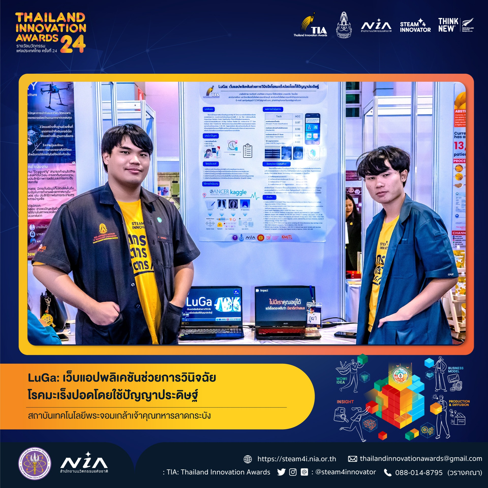

<h1 align="center"> เข้าร่วมการแข่งขัน </h1>
<h2 align="center"> 🚀 Thailand Innovation Awards ⭐ </h2>

<h3 align="center"> โครงงานนี้เป็นการพัฒนาเว็บแอปพลิเคชันที่ใช้เทคโนโลยีปัญญาประดิษฐ์ (AI) และการเรียนรู้ของเครื่อง (Machine Learning) เพื่อช่วยการวินิจฉัยโรคมะเร็งปอดของแพทย์เฉพาะทาง </h3>
